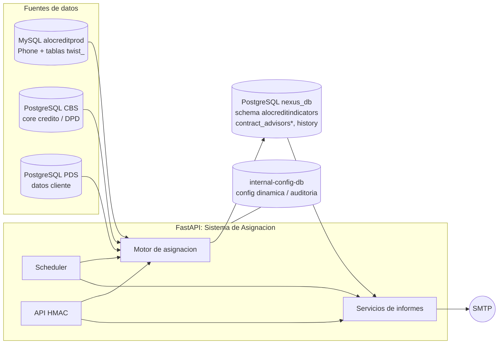

# Sistema de Asignación de Cartera

Servicio **FastAPI** que automatiza la asignación de la cartera en mora a las casas de cobranza
(**Cobyser** y **Serlefín**) para los tres productos del negocio — **Phone**, **Twist 1.0** y
**Twist 2.0** — y genera los informes operativos y de fin de ciclo.

> API firmada con **HMAC**, ejecución programada (scheduler), informes en Excel/CSV por correo y
> despliegue en **Docker**.

---

## Tabla de contenidos

- [Descripción general](#descripción-general)
- [Características](#características)
- [Arquitectura](#arquitectura)
- [Productos y reglas de asignación](#productos-y-reglas-de-asignación)
- [Estructura del proyecto](#estructura-del-proyecto)
- [Requisitos](#requisitos)
- [Configuración (`.env`)](#configuración-env)
- [Puesta en marcha](#puesta-en-marcha)
- [API](#api)
- [Informes](#informes)
- [Tareas programadas](#tareas-programadas)
- [Pruebas](#pruebas)
- [Scripts operativos](#scripts-operativos)
- [Documentación](#documentación)
- [Calidad de código (SonarQube)](#calidad-de-código-sonarqube)
- [Seguridad](#seguridad)

---

## Descripción general

El sistema toma los contratos en mora desde las bases de origen, aplica las **reglas de negocio de
asignación** (franjas de mora, reparto por casa, cédulas impares, exclusión de pagarés) y persiste el
resultado en las tablas de asesores de cada producto. Sobre esa asignación produce los **informes**
que se envían automáticamente a cada casa de cobranza y el **informe mensual de fin de ciclo**.

La asignación es **append-only**: nunca reasigna un contrato ya asignado; los contratos que "se mueven"
de franja con el tiempo (drift de mora) conservan su asignación original.

## Características

- 🧩 **Tres productos** en un mismo motor: Phone, Twist 1.0 y Twist 2.0, cada uno en su tabla.
- ⚖️ **Reglas de reparto** configurables: franja 31‑60 (solo Cobyser, cédulas impares), 61‑240 con
  reparto **40/60** Cobyser/Serlefín por bucket DPD.
- 🚫 **Exclusiones de negocio**: contratos endosados a pagaré y cartera al día (`<31`).
- 📊 **Informes** por producto (una hoja por producto) con paridad financiera total.
- 📧 **Envío automático** por correo a cada casa + informe de **fin de ciclo** mensual.
- 🔐 **API firmada con HMAC** (servidor‑a‑servidor).
- ⏰ **Scheduler** integrado (asignación diaria, notificaciones, cierre de mes).
- 🐳 **Docker / docker‑compose** listo para producción.

## Arquitectura



| Origen | Uso |
|---|---|
| **MySQL `alocreditprod`** | Cartera **Phone** y **Twist 1.0** (tablas `twist_*`). |
| **PostgreSQL CBS** (`:5434`) | Núcleo de crédito y días de mora (DPD) de **Twist 2.0**. |
| **PostgreSQL PDS** (`:5435`) | Datos de cliente de **Twist 2.0** (cédula, contacto). |
| **PostgreSQL `nexus_db`** (schema `alocreditindicators`) | Asignaciones e historial: `contract_advisors`, `contract_advisors_twist`, `contract_advisors_twist2`, `contract_advisors_history`. |
| **internal-config-db** (contenedor) | Configuración dinámica del panel y auditoría. |

## Productos y reglas de asignación

| Producto | Tabla de asignación | Fuente |
|---|---|---|
| **Phone** | `contract_advisors` | MySQL `alocreditprod` |
| **Twist 1.0** | `contract_advisors_twist` | MySQL `alocreditprod` (`twist_*`) |
| **Twist 2.0** | `contract_advisors_twist2` | PostgreSQL CBS + PDS |

**Reglas (idénticas para los tres productos):**

1. **Franja 31‑60** (`31_45` y `46_60`): se asigna **solo a Cobyser** y **solo cédulas impares**
   (terminadas en 1, 3, 5, 7, 9). Serlefín 0 %. Tipo `CEDULAS_IMPAR`.
2. **61‑240**: reparto **40 % Cobyser / 60 % Serlefín** por bucket DPD. Tipo `ASIGNACION`.
3. **Exclusión de pagarés**: se excluyen los contratos endosados a afianzadora
   (`pagare_status_id ∈ {1 Libraval, 2 Fianzavasa, 3 Figarantías}`), tanto en la asignación como en los informes.
4. **Cartera al día**: la mora `<31` no entra en los informes de Twist.

Estas reglas se configuran por entorno (ver [Configuración](#configuración-env)).

## Estructura del proyecto

```
.
├── app/                       # Aplicación (FastAPI)
│   ├── api/routes/            # Endpoints: assignment, collection_agency, reports
│   ├── core/                  # config (settings), dpd, seguridad HMAC
│   ├── database/              # conexiones y modelos SQLAlchemy
│   ├── services/              # motor de asignación, informes, scheduler, etc.
│   ├── runtime_config/        # configuración dinámica (DB interna) y auditoría
│   └── data/                  # datos inmutables (listas de contratos fijos)
├── tests/                     # Suite de pruebas (pytest): unit / integration / e2e
├── migrations/                # Migraciones de base de datos
├── scripts/                   # Scripts operativos (ver sección Scripts)
│   ├── checks/                # Diagnósticos y verificaciones manuales
│   ├── examples/              # Ejemplo de cliente HMAC
│   └── windows/               # .bat de apoyo (Windows)
├── docs/                      # Documentación detallada por tema
├── main.py                    # Punto de entrada (uvicorn main:app)
├── Dockerfile / docker-compose.yml
├── requirements.txt / requirements-dev.txt / pyproject.toml
└── sonar-project.properties   # Configuración de análisis SonarQube
```

## Requisitos

- **Python 3.10+** (probado en 3.10–3.12)
- **Docker** y **docker compose** (despliegue recomendado)
- Acceso de red a las bases MySQL/PostgreSQL de origen y a SMTP

## Configuración (`.env`)

La configuración se hace por **variables de entorno** (pydantic‑settings). Parte de
[`.env.example`](.env.example), que contiene **placeholders** (sin secretos):

```bash
cp .env.example .env
# edita .env con los valores reales del entorno
```

> 🔒 Los **secretos nunca van en archivos versionados**. En `docker-compose.yml` las contraseñas se
> inyectan con `${VAR}` desde el `.env` no versionado; en `.env.example` quedan vacías.

Variables principales: conexiones `MYSQL_*`, `POSTGRES_*`, `CBS_DB_*`, `PDS_DB_*`, `REPORTS_EXT_*`;
`SMTP_*` para correo; `API_HMAC_SECRET` para la firma; listas `COBYSER_USERS` / `SERLEFIN_USERS`;
y los flags de reglas (`FRANJA_COBYSER_*`, `PAGARE_EXCLUDE_*`, `DEFAULT_*_PERCENT`).

## Puesta en marcha

### Docker (recomendado)

```bash
docker compose up -d --build
docker compose ps           # health del contenedor
docker compose logs -f fastapi-app
```

La API queda en `http://localhost:8000` y la documentación interactiva en `http://localhost:8000/docs`.

### Local (desarrollo)

```bash
python -m venv .venv && source .venv/bin/activate
pip install -r requirements.txt -r requirements-dev.txt
uvicorn main:app --reload --port 8000
```

## API

Todos los routers están protegidos con **firma HMAC**. Cada petición debe incluir la cabecera
`X-Signature`:

```
X-Signature = HMAC_SHA256(API_HMAC_SECRET, method + path + body)
```

donde `path` **no** incluye la query string. Hay un cliente de ejemplo en
[`scripts/examples/hmac_client_example.py`](scripts/examples/hmac_client_example.py).

| Método | Ruta | Descripción |
|---|---|---|
| `GET`  | `/` · `/api/v1/health` | Estado del servicio |
| `POST` | `/api/v1/run-assignment` | Ejecuta el proceso de asignación |
| `POST` | `/api/v1/run-division` | Ejecuta la división de contratos |
| `POST` | `/api/v1/finalize-assignments` | Finaliza asignaciones |
| `POST` | `/api/v1/process-manual-fixed` | Procesa contratos fijos manuales |
| `GET`  | `/api/v1/lock-status` | Estado del lock del proceso |
| `GET`  | `/api/v1/reports/download/{house_key}` | Descarga el informe de una casa. Soporta `?format=json&product=all\|phone\|twist1\|twist2` |
| `GET`  | `/api/v1/reports/assignments/current` | Asignaciones actuales y estadísticas (incluye Twist1/Twist2) |
| `POST` | `/informe-casa-cobranza` · `GET /listar-informes` · `GET /descargar-informe/{tipo}` | Informes para casa de cobranza |

> La lista completa y actualizada de endpoints está siempre en `http://localhost:8000/docs` (OpenAPI).

## Informes

- **Por producto**: cada informe trae una **hoja por producto** (Phone / Twist1 / Twist2) y una
  columna `producto`, con **paridad financiera** (mismos descuentos y opciones de pago que Phone).
- **Día inicial**: el campo de día inicial sale de `contract_advisors_history.dias_atraso_inicial`.
- **Twist 2.0**: la `llave` y `contrato_x` usan el **external_id numérico** con formato `TWIST2_<id>`.
- **Envío**: automático por correo a Cobyser y Serlefín, y **informe mensual de fin de ciclo**.

## Tareas programadas

El scheduler integrado ejecuta (configurable por `.env`):

- **Asignación automática** (diaria).
- **Notificaciones** por correo a las casas en los días configurados.
- **Informe de fin de ciclo** + **cierre mensual** el último día del mes.

## Pruebas

```bash
pytest                      # suite completa
pytest -m unit              # solo unitarias (sin BD ni red)
pytest --cov=app --cov-report=term-missing
```

Marcadores disponibles: `unit`, `integration`, `e2e` (ver `pyproject.toml`).

## Scripts operativos

Todos viven en [`scripts/`](scripts/) y son **ejecutables desde cualquier ruta** (incluyen un
bootstrap que añade la raíz del repo al `PYTHONPATH`):

| Script | Función |
|---|---|
| `scripts/run_assignment_once.py` | Ejecuta una corrida de asignación |
| `scripts/run_assignment_debug.py` | Corrida de asignación con trazas |
| `scripts/run_division.py` | Ejecuta la división de contratos |
| `scripts/run_cycle_end_report.py` | Genera/envía el informe de fin de ciclo |
| `scripts/generate_and_send_reports.py` | Genera y envía los informes a las casas |
| `scripts/reset_assignments.py` | Reinicia asignaciones (operación delicada) |
| `scripts/insert_fixed_contracts.py` | Inserta contratos fijos |
| `scripts/checks/` | Diagnósticos y verificaciones manuales (conexiones, esquema, duplicados, etc.) |
| `scripts/examples/hmac_client_example.py` | Cliente de ejemplo para consumir la API firmada |

```bash
python scripts/run_assignment_once.py        # funciona desde la raíz o desde cualquier carpeta
```

## Documentación

Documentación temática en [`docs/`](docs/):

| Documento | Tema |
|---|---|
| [`docs/GUIA_RAPIDA.md`](docs/GUIA_RAPIDA.md) | Guía rápida de uso |
| [`docs/DOCKER_README.md`](docs/DOCKER_README.md) | Despliegue con Docker |
| [`docs/SISTEMA_INFORMES_README.md`](docs/SISTEMA_INFORMES_README.md) | Sistema de informes |
| [`docs/BASES_FIJAS.md`](docs/BASES_FIJAS.md) · [`docs/MIGRACION_BASES_FIJAS.md`](docs/MIGRACION_BASES_FIJAS.md) | Contratos fijos y su migración |
| [`docs/BALANCE_EQUITATIVO_README.md`](docs/BALANCE_EQUITATIVO_README.md) | Balance equitativo del reparto |
| [`docs/DIVISION_CONTRATOS.md`](docs/DIVISION_CONTRATOS.md) | División de contratos |
| [`docs/jira.md`](docs/jira.md) | Bitácora / changelog de cambios |

## Calidad de código (SonarQube)

El análisis se configura en [`sonar-project.properties`](sonar-project.properties)
(projectKey `cartera-asignacion-api`). Para correrlo:

```bash
pytest --cov=app --cov-report=xml          # genera coverage.xml
sonar-scanner -Dsonar.host.url=<url> -Dsonar.login=<token>
```

## Seguridad

- **Secretos fuera del control de versiones**: `.env` (gitignored) es la única fuente; el
  `docker-compose.yml` los inyecta con `${VAR}` y `.env.example` solo tiene placeholders.
- **API firmada con HMAC** en todos los endpoints.
- Si alguna credencial llegó a versionarse en el historial de git, **rótala** y consérvala únicamente
  fuera del repositorio (gestor de secretos / variables de CI).
